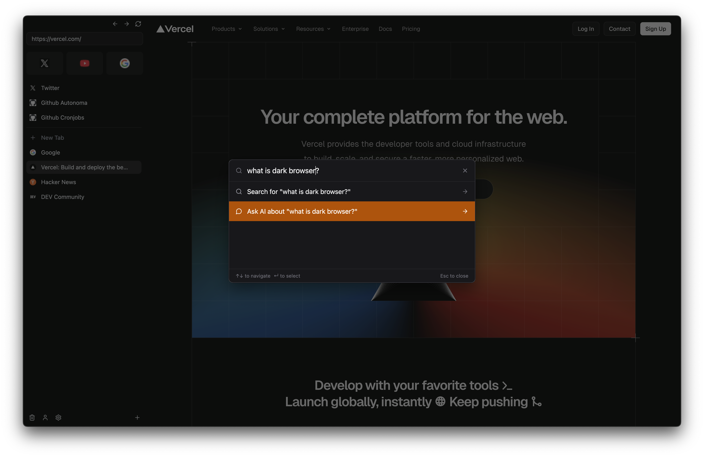

# Dark

> **"Hacking a browser shouldn't mean wrestling with C++."**



[See more screenshot here](/docs/screenshots)

Dark is a sleek, Electron-based browser you can bend, hack and make your own, 100% React + TypeScript under the hood. Built on Chromium (so you still get Chrome DevTools and ecosystem compatibility), Dark makes browser customization as easy as editing a React component.

---

## 🚀 Features

* **Fully Hackable**
  Everything in Dark is React + TypeScript. No C++ gatekeepers, if you know JS, you can extend or fork any part of the browser UI or behavior.

* **Chromium-Powered**
  Under the hood it's the same engine that powers Chrome, so all your favorite DevTools, extensions (via `session.loadExtension`), and web standards just work.

* **Modern UI**
  Built with React, Tailwind-style CSS and shadcn. Customize tabs, sidebars, themes, or even the entire address bar. The only rule is: "everything's Dark"

* **Cross-Platform**
  Runs on macOS, Windows, and Linux, package once, ship everywhere.

* **Open & Supported**
  Unlike Arc (which went closed-source), Dark is 100% Apache 2.0-licensed and is 100% community-driven. We'll be here to merge your PRs and ship updates.

---

## 🔒 Open Source Pledge

**Dark will always remain 100% open source.**

We solemnly pledge that:

* **Forever Open**: Dark will never go closed-source, proprietary, or behind paywalls
* **Permissive License**: We commit to maintaining Apache 2.0 (or equivalent permissive licensing) in perpetuity
* **Community Ownership**: The core project will always be owned and governed by the community
* **No Vendor Lock-in**: You can fork, modify, redistribute, and even commercialize Dark without restriction

> *This isn't just a promise, it's our foundational principle. Unlike other browsers that started open and went commercial, Dark's architecture, governance, and licensing ensure it stays hackable forever.*

---

## 📦 Getting Started

1. **Clone the repo**

   ```bash
   git clone https://github.com/tomaspiaggio/dark.git
   cd dark
   ```

2. **Install dependencies**

   ```bash
   npm install
   ```

3. **Run in dev mode**

   ```bash
   npm start
   ```

   Your custom browser will spin up with live-reload on React code changes.

4. **Build & Package**

   ```bash
   npm run build
   ```

---

## 🔧 How to Hack

1. All UI lives under `src/renderer/` as React components.
2. Main-process logic (window management, IPC handlers) sits in `src/main/`.
3. Want to override the tab switcher, add a custom sidebar widget, or tweak your new-tab page? Just dive in, edit a `.tsx`, and your changes show up instantly in `npm start`.

---

## 🤝 Contributing

We love contributions of all kinds:

* **Bug reports & feature requests** via GitHub Issues
* **Design ideas**, mockups, animations, new themes
* **Documentation fixes**, help us keep this README crystal clear!

---

## ❤️ Support & Sponsorship

Building and maintaining a browser engine wrapper is no small feat, and your support keeps Dark alive and thriving:

* ⭐ **Star** this repo
* 🐛 **Report bugs** or propose new features
* 💵 **Donate** 
  * BTC: bc1qwyz7zp2av6ftg63quqpf025eetqpssaqd7ud0y
  * USDC (Polygon): 0x8C03f4c53a9a46d78D8b15E7A0Ea8D530EC3cA3F
  * USDT (Polygon): 0x8C03f4c53a9a46d78D8b15E7A0Ea8D530EC3cA3F
* 🙌 **Spread the word** on Twitter, Mastodon, or your favorite tech blog
* 🐦 **Follow updates** [@tomaspiaggio](https://twitter.com/tomaspiaggio) for the latest Dark news

> **Your sponsorship helps pay for CI, hosting, and coffee to fuel late-night hacking sessions.**

---

<p align="center">
  Made with ❤️ by <a href="https://twitter.com/tomaspiaggio">@tomaspiaggio</a> and the Dark community  
</p>


# Help needed

## 🔧 Missing Features

| Feature | Description | Implementation Notes |
|---------|-------------|---------------------|
| **Extensions** | Support for loading Chrome extensions via `session.loadExtension()` | Use Electron's extension APIs to load .crx files or unpacked extensions |
| **Spaces** | Separate workspaces for different contexts (work, personal, studying) | Tab grouping with isolated sessions and visual workspace indicators |
| **Bookmarks** | Save, organize, and manage favorite websites | Persistent storage with folders, tags, and quick access toolbar |
| **Split Screen** | View multiple tabs side-by-side in the same window | Dynamic webview layout with resizable panes |
| **Cmd+L Focus Address** | Keyboard shortcut to focus the address bar | Global shortcut that moves cursor to URL input field |
| **Cmd+Shift+C Copy URL** | Quick keyboard shortcut to copy current page URL | Copy active tab's URL to clipboard without manual selection |
| **Multiple Instances** | Run multiple browser windows/processes simultaneously | Separate Electron processes for isolated browsing sessions |
| **Sleep Tabs** | Reduce memory usage by suspending inactive tabs | Unload tab content but preserve state for quick restoration |
| **Context Menu** | Right-click menus for pages, tabs, and UI elements | Custom context menus with copy, paste, inspect, and browser actions |
| **Quit Confirmation** | Ask before closing browser with Cmd+Q | Prevent accidental closure with "Are you sure?" dialog |
| **Config Menu** | Settings/preferences interface | Persistent settings for new tab URL, tab cleanup timing, hotkeys |
| **Landing Page** | Custom start page when opening browser | Branded homepage with quick actions and workspace selection |
| **Welcome Flow** | First-run onboarding experience | Guide users through space creation and basic browser features |
| **Cheatsheet** | Help documentation for keyboard shortcuts | In-app reference for all available hotkeys and gestures |
| **Printer Support** | Print web pages and PDFs | Electron's print API with preview and printer selection |
| **Enhanced New Tab** | Rich new tab experience with widgets | Transform about:blank into useful start page with quick actions |
| **Private Browsing** | Incognito mode with no history/cookies | Isolated session that doesn't persist data after closing |
| **History** | Browse and search previously visited pages | Persistent history with search, date filtering, and quick access |
| **Service Workers** | Full support for Progressive Web Apps | Enable offline functionality and push notifications |
| **Packaging & Release** | Build system for distributing the browser | Electron Builder setup for macOS, Windows, and Linux packages |
| **AI Features (Cmd+I)** | Cursor-style AI integration with user's API key | LLM integration for page summaries, Q&A, and content assistance |

## ✅ Completed Features

- [x] **Copy/Paste Menu** - Edit menu items that target the active tab
- [x] **Persistent State** - Settings and sessions are saved between launches  
- [x] **Sidebar Toggle** - Collapsible sidebar for more screen space
- [x] **Find in Page (Cmd+F)** - Search text within the current page
- [x] **New Tab** - Create new tabs with keyboard shortcuts

# Bugs

- [ ] when changing tabs, the new size of the view should be the size of the window
- [ ] switcher on control+tab+tab doesn't close automatically, need to do enter
- [ ] when closing sidebar there's a white strip
- [ ] title changes on the frontend but is not actually stored or returned